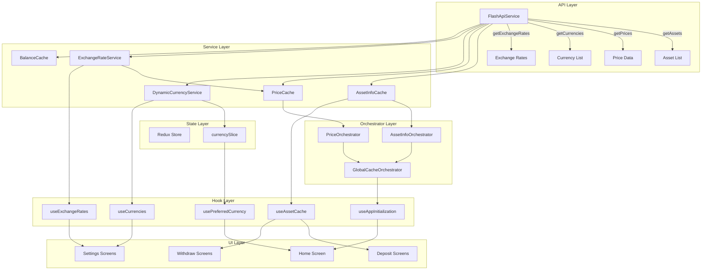

# Remove Hardcoded Data Implementation Plan

## Overview

This plan outlines the systematic removal of all hardcoded asset data, currencies, exchange rates, and prices from the flash-merchant application. All data will be fetched dynamically from the API through the established service layer.

## Current State Analysis

### Hardcoded Data Locations

| File | Hardcoded Data | Impact |
|------|---------------|--------|
| `services/AssetInfoOrchestrator.ts` | `DEFAULT_ASSETS = ['ethereum', 'solana', 'bnb', 'usdt', 'bitcoin']` | Asset prefetching |
| `services/PriceOrchestrator.ts` | `DEFAULT_ASSETS = ['ethereum', 'solana', 'bnb', 'usdt', 'bitcoin']` | Price fetching |
| `app/wallet/deposit/types.ts` | `DEFAULT_ASSETS` array with full asset objects | Deposit flow |
| `app/wallet/withdraw/types.ts` | `ASSETS` array and `EXCHANGE_RATES` object | Withdraw flow |
| `store/slices/currencySlice.ts` | `DEFAULT_CURRENCY = 'USD'` | Currency state |
| `hooks/useCurrency.ts` | `DEFAULT_CURRENCY = 'USD'` | Currency hook |

### Existing Services (Already API-Connected)

- **FlashApiService** - Has `getAssets()`, `getPrices()`, `getCurrencies()`, `getExchangeRates()`
- **DynamicCurrencyService** - Fetches currencies from API with caching
- **ExchangeRateService** - Fetches exchange rates from API with caching
- **AssetInfoCache** - Caches asset info from API
- **PriceCache** - Caches prices from API
- **BalanceCache** - Caches wallet balances from API

## Architecture Flow



## Implementation Steps

### Phase 1: Service Layer Updates

#### 1.1 Update AssetInfoOrchestrator
**File:** `services/AssetInfoOrchestrator.ts`

**Changes:**
- Remove hardcoded `DEFAULT_ASSETS` array
- Add `fetchAssetList()` method to get assets from API
- Update `initialize()` to fetch assets dynamically
- Store fetched asset IDs for periodic prefetch

```typescript
// Before
const DEFAULT_ASSETS = ['ethereum', 'solana', 'bnb', 'usdt', 'bitcoin'];

// After
// No hardcoded assets - fetch from API
private assetIds: string[] = [];

async initialize(): Promise<void> {
    const assetsResponse = await FlashApiService.getAssets();
    if (assetsResponse.success && assetsResponse.data) {
        this.assetIds = assetsResponse.data.assets.map(a => a.id);
        await assetInfoCache.getAssets(this.assetIds);
    }
}
```

#### 1.2 Update PriceOrchestrator
**File:** `services/PriceOrchestrator.ts`

**Changes:**
- Remove hardcoded `DEFAULT_ASSETS` array
- Add `fetchAssetList()` method or receive asset IDs
- Update `initialize()` to fetch prices for dynamic assets
- Update `refreshPrices()` to use dynamic asset list

#### 1.3 Update GlobalCacheOrchestrator
**File:** `services/GlobalCacheOrchestrator.ts`

**Changes:**
- Coordinate asset list fetching between orchestrators
- Ensure assets are fetched before prices

### Phase 2: Type Definitions Cleanup

#### 2.1 Update Deposit Types
**File:** `app/wallet/deposit/types.ts`

**Changes:**
- Remove `DEFAULT_ASSETS` array
- Remove `ASSETS` export
- Keep `Asset` interface and `convertAPIAsset()` function
- Components should use `useAssetCache` hook instead

#### 2.2 Update Withdraw Types
**File:** `app/wallet/withdraw/types.ts`

**Changes:**
- Remove `ASSETS` array
- Remove `EXCHANGE_RATES` object
- Update `Asset` interface to match API format
- Components should use hooks for data

### Phase 3: Currency Defaults

#### 3.1 Update Currency Slice
**File:** `store/slices/currencySlice.ts`

**Changes:**
- Remove hardcoded `DEFAULT_CURRENCY`
- Fetch default from `DynamicCurrencyService` or use first enabled currency
- Consider adding `defaultCurrency` to API response

#### 3.2 Update Currency Hook
**File:** `hooks/useCurrency.ts`

**Changes:**
- Remove hardcoded `DEFAULT_CURRENCY`
- Get default from Redux state or DynamicCurrencyService

### Phase 4: Component Updates

#### 4.1 Deposit Flow Components

**Files to Update:**
- `app/wallet/deposit/AssetSelector.tsx`
- `app/wallet/deposit/SelectAssetAmount.tsx`
- `app/wallet/deposit/TransactionSummary.tsx`

**Changes:**
- Import and use `useAssetCache` hook
- Remove imports of `DEFAULT_ASSETS` or `ASSETS`
- Handle loading states while assets fetch

#### 4.2 Withdraw Flow Components

**Files to Update:**
- `app/wallet/withdraw/SelectFlashTagAsset.tsx`
- `app/wallet/withdraw/EnterAmount.tsx`
- `app/wallet/withdraw/EnterPin.tsx`

**Changes:**
- Import and use `useAssetCache` hook
- Import and use `useExchangeRates` hook
- Remove imports of `ASSETS` and `EXCHANGE_RATES`
- Handle loading states

#### 4.3 Settings Components

**Files to Update:**
- `app/settings/currency.tsx`
- `app/settings/exchange-rate.tsx`

**Changes:**
- Use `useCurrencies` hook for currency list
- Use `useExchangeRates` hook for rates
- Remove any hardcoded currency lists

#### 4.4 Home Screen

**File:** `app/(tabs)/home.tsx`

**Changes:**
- Use `useAppInitialization` hook
- Use `useBalanceCache` for balances
- Use `usePreferredCurrency` for formatting

### Phase 5: Remove Mock Fallbacks

#### 5.1 Audit All Fallbacks
Search for and remove:
- `|| 'USD'` fallbacks that should come from API
- `|| []` fallbacks for asset arrays
- Mock data in services

#### 5.2 Error Handling
- Ensure proper error states when API fails
- Show appropriate UI feedback
- Don't silently fall back to hardcoded data

## File Change Summary

### Services (Modify)
| File | Action |
|------|--------|
| `services/AssetInfoOrchestrator.ts` | Remove DEFAULT_ASSETS, add dynamic fetching |
| `services/PriceOrchestrator.ts` | Remove DEFAULT_ASSETS, use dynamic list |
| `services/GlobalCacheOrchestrator.ts` | Coordinate asset list fetching |

### Types (Modify)
| File | Action |
|------|--------|
| `app/wallet/deposit/types.ts` | Remove DEFAULT_ASSETS and ASSETS exports |
| `app/wallet/withdraw/types.ts` | Remove ASSETS and EXCHANGE_RATES exports |

### Store (Modify)
| File | Action |
|------|--------|
| `store/slices/currencySlice.ts` | Remove DEFAULT_CURRENCY constant |

### Hooks (Modify)
| File | Action |
|------|--------|
| `hooks/useCurrency.ts` | Remove DEFAULT_CURRENCY constant |

### Components (Modify)
| File | Action |
|------|--------|
| `app/wallet/deposit/AssetSelector.tsx` | Use useAssetCache |
| `app/wallet/deposit/SelectAssetAmount.tsx` | Use useAssetCache |
| `app/wallet/deposit/TransactionSummary.tsx` | Use useAssetCache |
| `app/wallet/withdraw/SelectFlashTagAsset.tsx` | Use useAssetCache |
| `app/wallet/withdraw/EnterAmount.tsx` | Use useAssetCache, useExchangeRates |
| `app/settings/currency.tsx` | Use useCurrencies |
| `app/settings/exchange-rate.tsx` | Use useExchangeRates |
| `app/(tabs)/home.tsx` | Use useAppInitialization, useBalanceCache |

## Testing Checklist

- [ ] App initializes without hardcoded data
- [ ] Assets load from API on app start
- [ ] Prices load from API on app start
- [ ] Currencies load from API on app start
- [ ] Exchange rates load from API on app start
- [ ] Deposit flow works with dynamic assets
- [ ] Withdraw flow works with dynamic assets
- [ ] Currency selection shows API currencies
- [ ] Exchange rate display shows API rates
- [ ] Home screen shows dynamic balances
- [ ] Error states display when API fails
- [ ] No console errors about missing data

## Risk Mitigation

1. **API Unavailable**: Show clear error message, don't fall back to mock data
2. **Slow API**: Show loading states, use cached data if available
3. **Empty Response**: Show empty state UI, allow retry
4. **Partial Data**: Show what's available, indicate missing data

## Dependencies

- Existing service layer must be functional
- API endpoints must be accessible
- Redux store must be properly configured

## Rollback Plan

If issues arise:
1. Revert to previous commit
2. Check API connectivity
3. Verify service configuration
4. Review error logs for specific failures
