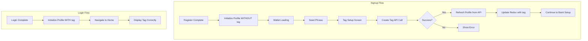

# Fix: Tag Not Displaying After Signup Flow

## Problem Statement

After completing the signup flow, the home screen displays "@User" instead of the actual merchant tag (e.g., "@johndoe"). However, after the login flow, the tag displays correctly.

## Root Cause Analysis

### Login Flow (Works Correctly)

1. User enters OTP in [`otp.tsx`](app/auth/login/otp.tsx:72-125)
2. `merchantApi.loginComplete()` returns merchant data
3. `merchantProfileOrchestrator.initialize(merchantData)` is called (line 100-101)
4. This updates Redux store with complete merchant profile including `normalizedTag`
5. Home screen reads `merchantProfile.normalizedTag` and displays correctly

### Signup Flow (Broken)

1. User completes OTP verification in [`index.tsx`](app/auth/create-wallet/index.tsx:563-606)
2. `merchantApi.registerComplete()` returns merchant data **WITHOUT tag** (tag not set yet)
3. `merchantProfileOrchestrator.initialize(finalData.merchant)` is called (line 736)
4. User is redirected to wallet loading → seed phrase → tag setup
5. In [`tag.tsx`](app/auth/setup/tag.tsx:84-149), user creates their tag
6. `merchantApi.addMerchantTag()` succeeds but **does NOT update Redux**
7. User completes onboarding and reaches home screen
8. Redux still has old merchant profile without `normalizedTag`
9. Home screen displays "@User" as fallback

## Solution

Update the merchant profile in Redux after successful tag creation in [`tag.tsx`](app/auth/setup/tag.tsx).

### Implementation Options

#### Option A: Refresh Profile from API (Recommended)

After successful tag creation, call `merchantProfileOrchestrator.refresh()` to fetch the updated profile from the API.

**Pros:**
- Ensures data consistency with backend
- Gets all updated fields, not just tag
- Reuses existing infrastructure

**Cons:**
- Additional API call
- Slight delay before UI updates

#### Option B: Update Local State Only

Dispatch `setMerchantProfile` with updated tag value directly.

**Pros:**
- Immediate UI update
- No additional API call

**Cons:**
- May miss other updated fields
- Potential data inconsistency

### Recommended Approach: Option A

Modify [`tag.tsx`](app/auth/setup/tag.tsx) to refresh the merchant profile after successful tag creation.

## Files to Modify

### 1. `app/auth/setup/tag.tsx`

Add import for `merchantProfileOrchestrator` and call `refresh()` after successful tag creation.

```typescript
// Add import
import { merchantProfileOrchestrator } from '@/services/MerchantProfileOrchestrator';

// In handleNext function, after successful tag creation:
if (isSuccess) {
  // Refresh merchant profile to get updated tag
  await merchantProfileOrchestrator.refresh();
  
  await setOnboardingStep(ONBOARDING_STEPS.bank_setup);
  Alert.alert('Success', response.message || 'Merchant tag created successfully!', [
    {
      text: 'Continue',
      onPress: () => router.replace('/auth/setup/bank_setup'),
    },
  ]);
}
```

## Flow Diagram



## Testing Checklist

- [ ] Signup flow: Create new account and verify tag displays on home screen
- [ ] Login flow: Verify tag still displays correctly after login
- [ ] Edge case: Verify behavior when tag creation fails
- [ ] Edge case: Verify behavior when profile refresh fails
- [ ] Verify profile is persisted correctly for app restarts

## Implementation Steps

1. Open [`tag.tsx`](app/auth/setup/tag.tsx)
2. Add import for `merchantProfileOrchestrator`
3. Call `merchantProfileOrchestrator.refresh()` after successful tag creation
4. Handle potential errors gracefully
5. Test the complete signup flow
